# 📦 일일 잡일 대행 구인 서비스(JOB일)

<br>

<p align="center">
  <!-- Backend Technologies -->
  
  &nbsp;&nbsp;
  
  &nbsp;&nbsp;
  <br>
  
  &nbsp;&nbsp;
  
  <br/>
  
  &nbsp;&nbsp;
  
  &nbsp;&nbsp;
  
  &nbsp;&nbsp;
  <br>
  
  
  &nbsp;&nbsp;
  <br/>
  
  &nbsp;&nbsp;
  
  &nbsp;&nbsp;
  
  <br/>
  
  &nbsp;&nbsp;
  
  &nbsp;&nbsp;
  
  &nbsp;&nbsp;
  
  <br>
  
  
</p>


<br>

| 이름   | 담당 업무             | GitHub 주소      |
| ------ | -------------------|------------    |
| 복광수👑 | 팀장/백엔드 개발       |[KwangSoo1555](https://github.com/KwangSoo1555)     |   
| 김만규 | 백엔드 개발 / 프론트 개발 |[fierceCry](https://github.com/fierceCry)           |
| 김영규 | 백엔드 개발            |[ykyu99](https://github.com/ykyu99?tab=repositories)|
| 구남욱 | 백엔드 개발            |[G00N4mUk](https://github.com/9r3dflam3)            | 
| 이지훈 | 백엔드 개발            |[piggytiger](https://github.com/dokidokitiger)      |

<br>

## 1. 프로젝트 소개

배00 민족 라이더 픽업 서비스를 오마주하여 유저들 간 간단한 일손부터 하루 일당에 해당하는 일감까지 쉽고 빠르게 유저들을 매칭하여 혼자서 해결하기 어려운 일들을 일정 급여를 통해 해결하도록 돕는 플랫폼 입니다.

<br>

# 배포된 주소/API 명세서(Notion)
[배포된 웹사이트](https://sparta-final-project.netlify.app/)

[API 명세서 (Notion)](https://teamsparta.notion.site/RESTFUL-7-4617890252d0426eab1cc8ecc20aab66)


<br>

## 2.서비스 기능

### Auth(인증)
- 이메일 인증
- 회원가입
- 로그인
- google 로그인
- 비밀번호 찾기
- Access Token 재발급
  
<details>
  <summary>자세히 보기</summary>
  
  #### 이메일 인증
  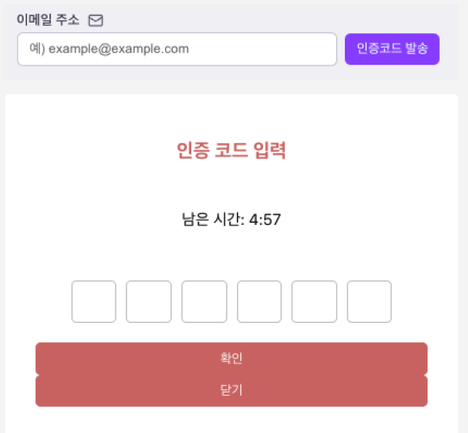
  <br>
  - 인증 이메일을 발송하고, 사용자가 이메일 내 인증코드를 작성하여 인증을 완료합니다.

  #### 회원가입
  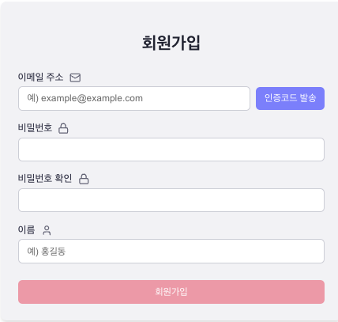
  <br>
  - 사용자에게 인증코드와 이메일, 패스워드, 이름을 받아 회원가입을 완료합니다.

  #### 로그인
  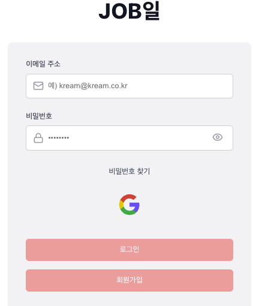
  <br>
  - 사용자에게 이메일, 패스워드를 받아 로그인을 완료하여 Access Token과 Refresh Token을 전달합니다.

  #### 구글 로그인
  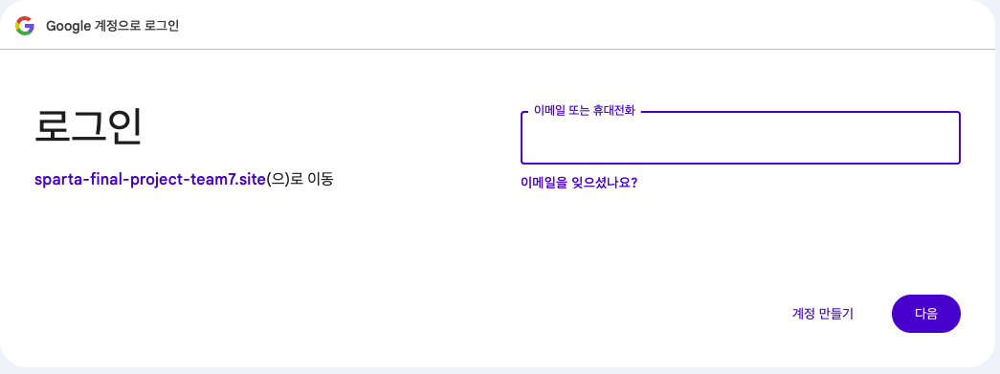
  <br>
  - 구글 계정을 사용하여 로그인을 처리하여 Access Token과 Refresh Token을 전달합니다.

  #### 비밀번호 찾기
  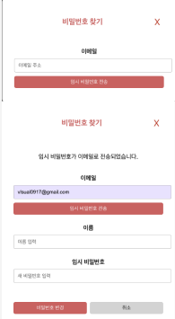
  <br>
  - 사용자가 이메일을 작성하면 임시 패스워드를 이메일로 전송하여, 이메일로 전송한 임시 패스워드와 이름을 작성하여 비밀번호를 수정합니다.
</details>

### User(사용자)
- 내 정보 조회
- 로그아웃
- 회원탈퇴
<details>
  <summary>자세히 보기</summary>
  
  #### 내 정보 조회
  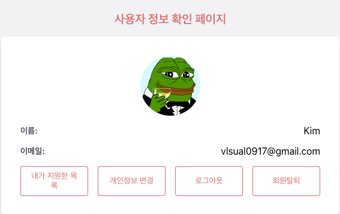
  <br>
  - 서버에 Access Token을 전달하여 사용자의 본인 정보를 조회합니다.

  #### 로그아웃
  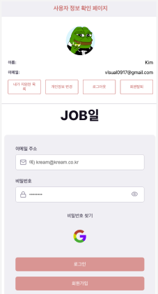
  <br>
  - 사용자가 로그아웃 버튼을 누르면 서버에 Access Token을 전달하여 로그아웃을 처리하고 로그인 페이지로 이동합니다.

  #### 회원탈퇴
  
  <br>
  - 사용자가 회원탈퇴 버튼을 누르면 서버에 Access Token을 전달하여 회원을 탈퇴시키고 로그인 페이지로 이동합니다.

</details>

### Job(잡일)
- Job 목록 조회
- Job 상세 조회
- Job 원하는 지역 설정
- Job 등록
- Job 삭제
- Job-matching(수락)
- Job-matching(삭제)
<details>
  <summary>자세히 보기</summary>

  #### Job 목록 조회
  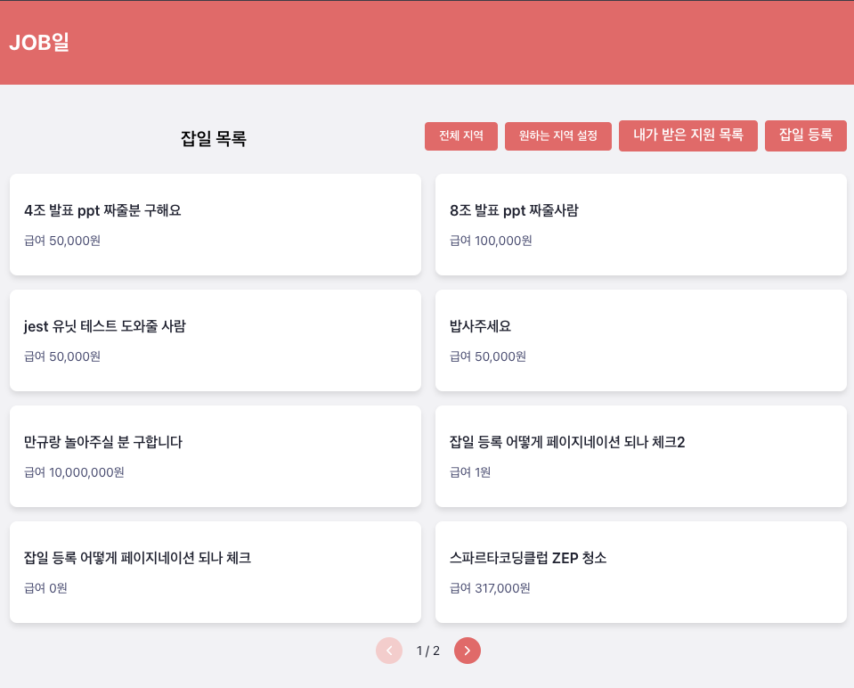
  <br>
  - 사용자가 메인페이지에 들어왔을때 서버에 Access Token을 전달하여 Job 목록을 받아 최신순으로 나열합니다.

  #### Job 상세 조회
  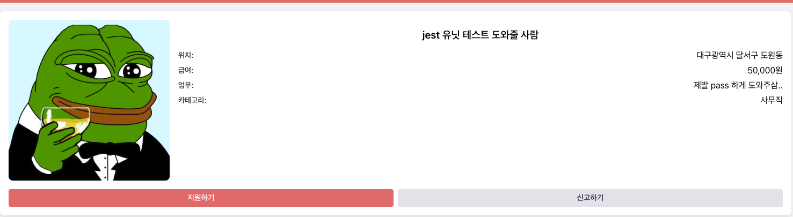
  <br>
  - 사용자가 메인페이지에서 Job 하나 클릭하면 Job일에 지역, 급여, 카테고리 상세 정보가 나옵니다.

  #### Job 원하는 지역 설정
  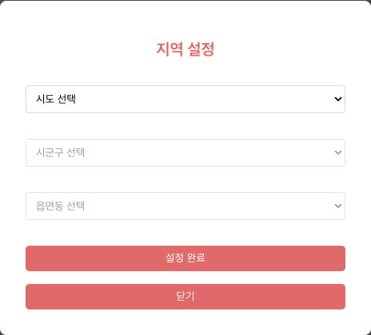
  <br>
  - 사용자가 메인페이지에서 원하는 지역설정 버튼을 클릭하게 될 경우 원하는 지역을 설정하여 Job 목록이 원하는 지역으로 설정한 목록만 나오게 됩니다.

  #### Job 등록
  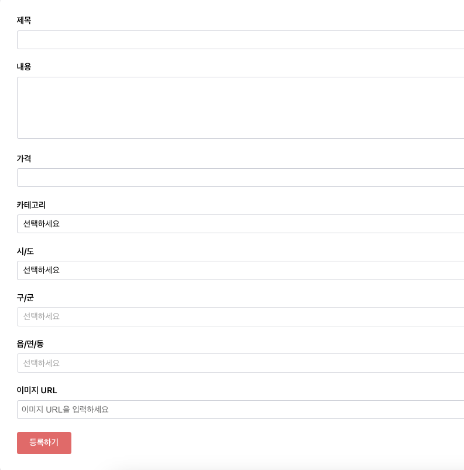
  <br>
  - 사용자가 잡입등록 버튼을 누르고 잡일등록을 위한 데이터를 작성하고 등록버튼을 클릭하였을때 생성이 됩니다.

  <!-- #### Job 삭제
  
  <br>
  - 사용자가 선택한 Job을 삭제하기 위해 서버에 Access Token을 전달합니다. -->

  #### Job-matching(수락)
  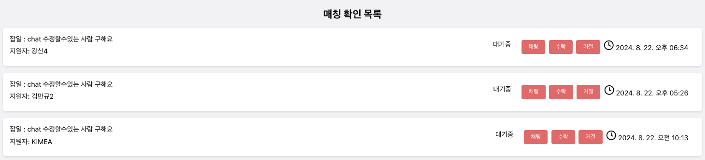
  <br>
  - 사용자가 수락 버튼을 누르게 될 경우 Job일에 사용자와 매칭이 됩니다.

  #### Job-matching(삭제)
  
  <br>
  - 사용자가 거절 버튼을 누르게 될 경우 Job일에 사용자와 매칭이 거절됩니다.

</details>

### Report(신고하기)
- 신고 생성
- 신고 삭제
- 신고 수정
<details>
  <summary>자세히 보기</summary>
  
  #### 신고 생성
  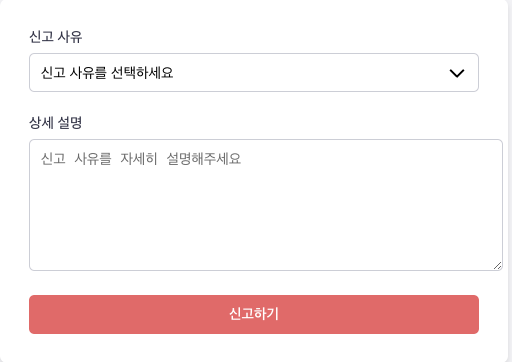
  <br>
  - 사용자가 Job일 상세 또는 채팅에서 신고를 할 때 다른 사용자에게 신고를 생성합니다.
</details>

### notices(공지사항)
- 공지사항 생성
- 공지사항 수정
- 공시자항 삭제
- 공지사항 목록 조회
- 공지사항 상세 조회
<details>
  <summary>자세히 보기</summary>
  
  #### 공지시항 생성
  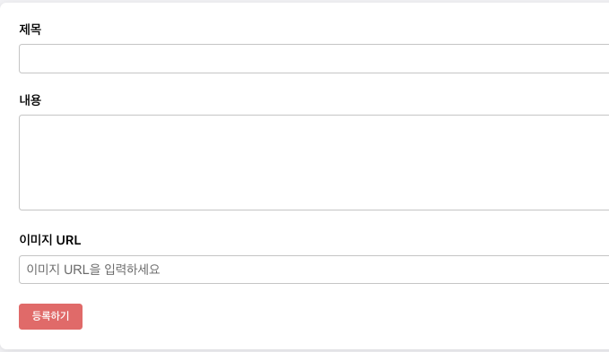
  <br>
  - admin유저가 공지사항 생성 버튼을 누르면 제목, 내용, 이미지를 받아 생성합니다.
  
  #### 공지사항 수정
  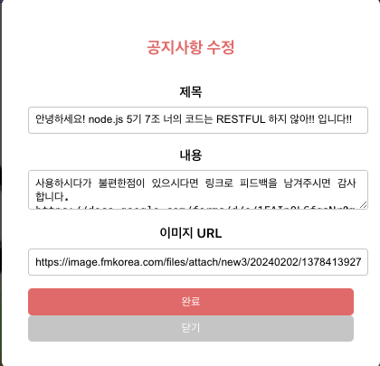
  <br>
  - admin유저가 공지사항 수정버튼을 누르면 작성되어있는 내용들이 나오고 수정을 하여 완료를 누르면 수정완료가 됩니다.
  
  #### 공지사항 삭제
  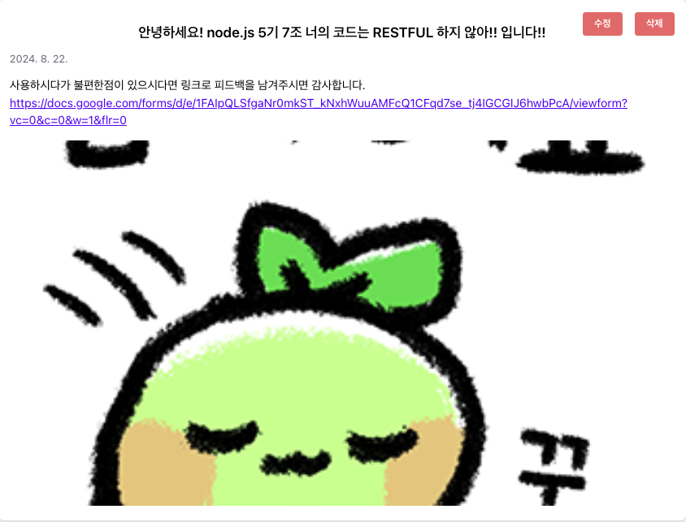
  <br>
  - admin유저가 공지사항 삭제버튼을 누르면 서버에서 데이터를 삭제합니다. 클라이언트에서는 메인페이지로 이동합니다.

  #### 공지사항 목록 조회
  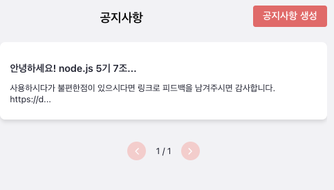
  <br>
  - 모든 유저가 서버에 Access Token을 전달하고 메인페이지에서 2개씩 공지사항 목록을 확인할수있습니다.

  #### 공지사항 상세 조회
  
  <br>
  - 모든 유저가 서버에 Access Token을 전달하고 메인페이지에서 공지사항을 클릭하면 공지사항 자세한 내용을 확인할수있습니다.
</details>

### Chat(채팅)
- 채팅방 목록 조회
- 채팅방 입장(Socket.io)
- 채팅 보내기(Socket.io)
<details>
  <summary>자세히 보기</summary>
  
  #### 채팅 목록 조회
  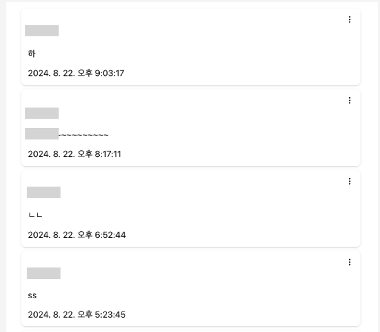
  <br>
  - 사용자가 참여 중인 채팅방 목록을 보여줍니다.

  #### 채팅방 입장
  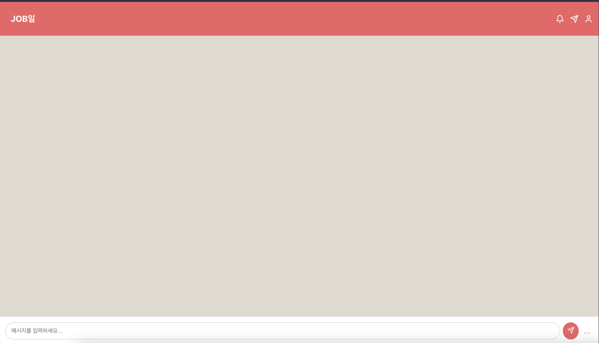
  <br>
  - 지원 목록 또는 채팅 목록에서 선택한 채팅방에 입장합니다.

  #### 채팅 보내기
  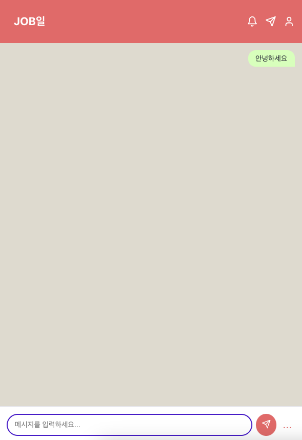
  <br>
  - 채팅방에서 메시지를 상대방에게 보낼 수 있습니다.

</details>


### notifications(알림)
- 받은 알림 목록 조회(최신순)
- 알림 전송(Redis PubSub)
<details>
  <summary>자세히 보기</summary>
  
  #### 받은 알림 목록 조회
  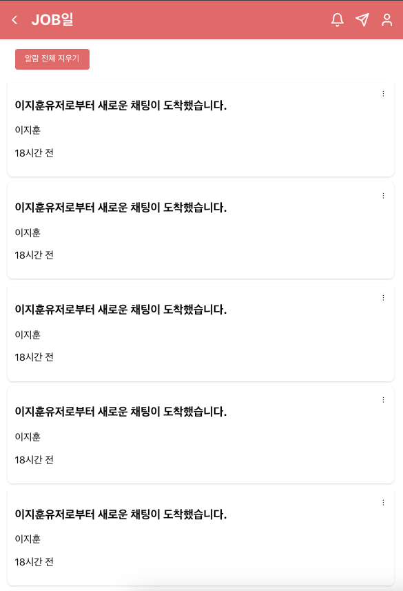
  <br>
  - 사용자가 지금까지 받았던 알림 목록을 최신순으로 볼수있습니다.

  #### 알림 전송
  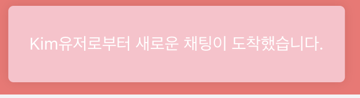
  <br>
  - 다른 사용자가 본인에게 job일 지원 또는 채팅을 보넀을 때 알림을 보냅니다.
</details>
<br>

## 프로젝트 구성

### 🎥 시연 영상
[](https://youtu.be/1zLzlz1jt2w)

### 와이어 프레임

<br>

### ERD


### Architecture


<br>

## Installation

<details>
  <summary>설치 방법</summary>

  ```bash
  $ git clone https://github.com/KwangSoo1555/sparta-final-project.git
  ```

  ```bash
  $ npm install
  ```

</details>

<br>

## Environment Variables

<details>
  <summary>환경 변수 설정</summary>

  프로젝트 루트 디렉토리에 `.env` 파일을 생성하고 설정합니다:

  ```plaintext
# 서버 포트 번호
SERVER_PORT=
# MySQL database 연결 정보
MYSQL_URI=
# Tokens secret key
ACCESS_TOKEN_SECRET=
REFRESH_TOKEN_SECRET=
# nodemailer 인증 관련
MAIL_AUTH_USER=
MAIL_AUTH_PASS=
# Redis 연결 정보
REDIS_PORT=
REDIS_HOST=
REDIS_USERNAME=
REDIS_PASSWORD=
# Google OAuth 관련
GOOGLE_CLIENT_ID=
GOOGLE_CLIENT_SECRET=
GOOGLE_CALLBACK_URL=
# Naver OAuth 관련
NAVER_CLIENT_ID=
NAVER_CLIENT_SECRET=
NAVER_CALLBACK_URL=
# Kakao OAuth 관련
KAKAO_CLIENT_ID=
KAKAO_CLIENT_SECRET=
KAKAO_CALLBACK_URL=
# development 환경과 production 환경 설정
NODE_ENV=
# AWS 관련
AWS_ACCESS_KEY_ID=
AWS_SECRET_ACCESS_KEY=
AWS_REGION=
  ```

  필요한 변수들은 프로젝트에 따라 다를 수 있습니다. 각 변수의 값은 프로젝트 설정에 맞게 수정해야 합니다.
  
</details>

<br>

## Create Faker data

<details>
  <summary>Faker 데이터 생성</summary>

  ```bash
  $ npm run seed
  ```

</details>

<br>

## Running the app

<details>
  <summary>앱 실행</summary>

  ```bash
  # watch mode
  $ npm run start:dev
  ```

</details>

<br>

## Test

<details>
  <summary>테스트 실행</summary>

  ```bash
  # unit tests
  $ npm run test
  ```
  
</details>
# sparta-final-project-dev
# sparta-final-project-dev
